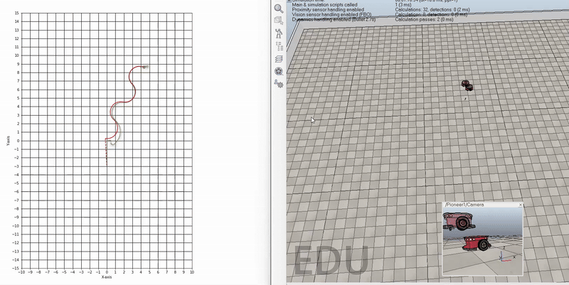

# ED5315 Assignment-3
EKF-based localisation for a mobile robot (Visualized in Coppleiasim(V-REP))

## Setup:
OS: Windows 10/11; Ubuntu 20.04

Python: 3.6.x
Coppeliasim: V4.3.0

To check the compatibility of your system, follow the instructions [here](https://github.com/BijoSebastian/ED5315_Mobile_Robot_Sim_Setup/tree/main/Demo) and run the demo script.

## Instructions:

  1. Download the setup provided in this repository. If you are familiar with how to use git on windows do that, if not click on the green button that says code and click on download zip. Once the download is complete, double click to extract the contents and place them in a location of your choice, the downloads folder itself works fine.

  2. Complete the **update** function in the file **update_eq_sub.py**. You need to define the update step of the Extended kalman filter. Measurements are square of distance from origin and orientation of the robot.  Do not make any changes to the other code files provided to you.

  3. Once you have completed defining the update function, launch Coppeliasim. Click on File->Open Scene. Navigate to the downloaded setup and select the file “mobile robot_odom.ttt”. 

  4. Launch Spyder. Click on File -> Open and navigate to the downloaded setup. Select the file main.py, run it by clicking on the green play button.(Always ensure you are in the same repository!) 

  5.	If you had defined the update step correctly, you will see a robot moving along with a phantom robot. The real robot is the ground truth and the phantom robot 's position is based on your EKF implementation.

## Solution video:
Your output would look like this.

